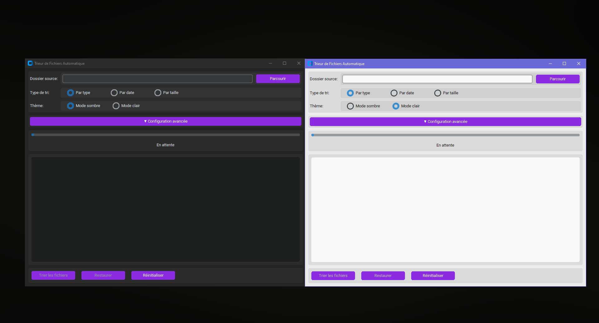

# Trieur de Fichiers Automatique - Version 1.0



Une application Python avec interface graphique CustomTkinter permettant de trier automatiquement les fichiers d'un dossier spécifié selon plusieurs critères (type, date, taille).

## 🌟 Fonctionnalités

- **Interface graphique moderne** développée avec CustomTkinter
  - Thème sombre par défaut avec option de basculer en mode clair
  - Boutons de couleur mauve avec texte blanc
  - Barre de progression pour suivre l'avancement du tri

- **Options de tri flexibles**
  - Tri par type de fichier (images, vidéos, documents, etc.)
  - Tri par date de création/modification
  - Tri par taille de fichier (petits, moyens, grands)

- **Organisation hiérarchique**
  - Dossiers principaux par catégorie
  - Sous-dossiers par extension (optionnel)
  - Personnalisation des noms de dossiers

- **Sécurité et configuration**
  - Sauvegarde des emplacements originaux pour restauration
  - Sauvegarde des préférences utilisateur
  - Journal détaillé des opérations et erreurs

## 📋 Prérequis

- Python 3.11 ou supérieur
- CustomTkinter
- Pillow

## 🚀 Installation

1. Cloner le repository
   ```bash
   git clone https://github.com/Blowdok/trieur-fichiers-automatique.git
   cd trieur-fichiers-automatique
   ```

2. Installer les dépendances
   ```bash
   pip install -r requirements.txt
   ```

3. Lancer l'application
   ```bash
   python trieur_fichiers_auto.py
   ```

## 📖 Utilisation

1. **Sélection du dossier source**
   - Cliquez sur "Parcourir" pour sélectionner le dossier à trier

2. **Configuration du tri**
   - Choisissez le mode de tri (par type, date ou taille)
   - Activez les options avancées si nécessaire (sous-dossiers par extension, etc.)
   - Personnalisez les noms des catégories via le bouton "Personnaliser"

3. **Lancement du tri**
   - Cliquez sur "Trier les fichiers"
   - Suivez la progression dans la barre d'état et le journal

4. **Restauration (si nécessaire)**
   - Cliquez sur "Restaurer" pour annuler le tri et remettre les fichiers à leur emplacement initial

## 📁 Structure du projet

```
Trieur_Fichiers_Automatique/
├── trieur_fichiers_auto.py            # Script principal
├── requirements.txt                   # Dépendances du projet
├── README.md                          # Documentation
├── LICENSE                            # License MIT
└── screenshots/                       # Dossier captures d'écran de l'application
    └── screenshots_sombre_clair.png   # Capture d'écran  pour la documentation
```

## 📝 Structure du code

Le code est organisé en deux classes principales :

- **TrieurFichiers** : Gère la logique de tri et de restauration des fichiers
  - Détermine les types de fichiers
  - Crée la structure de dossiers
  - Déplace les fichiers
  - Gère la sauvegarde et la restauration

- **ApplicationTrieurFichiers** : Gère l'interface graphique
  - Affiche les options et contrôles
  - Gère les entrées utilisateur
  - Met à jour la barre de progression
  - Affiche le journal des opérations

## 🛠️ Personnalisation

Vous pouvez facilement étendre les fonctionnalités en modifiant :
- Les types de fichiers reconnus (TYPES_FICHIERS dans le code)
- Les catégories de taille (TAILLES_FICHIERS dans le code)
- L'apparence de l'interface graphique (couleurs, dispositions, etc.)

## 📜 Licence

Ce projet est distribué sous la licence MIT. Voir le fichier [LICENSE](LICENSE) pour plus d'informations.

## 👥 Contribution

Les contributions sont les bienvenues ! N'hésitez pas à ouvrir une issue ou à soumettre une pull request.
